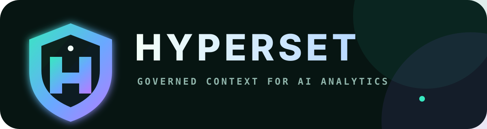

# Hyperset

<strong>Give agents one place to find your company's context.</strong> 
Start with one domain. Questions show what's missing; feedback gives the team a clear next change to review.

  
  
  
  
  
  

  <a href="#start-here">Start here</a> ·
  <a href="#the-flywheel">The flywheel</a> ·
  <a href="#connect-an-agent-with-mcp">MCP</a> ·
  <a href="docs/architecture.md">Architecture</a> ·
  <a href="AGENTS.md">Agent guide</a> ·
  <a href="https://github.com/waddle-zoo/hypermorph/issues">Issues</a>

> [!WARNING]
> Hyperset is pre-1.0. `make up-demo` is a local, host-loopback-only demo.
> Configure authentication and durable secrets before exposing it to a
> network.

<table width="100%" style="width:100%;display:table;table-layout:fixed">
  <tr>
    <td align="center" width="25%"> 🧠 <b>Company context</b> Start with one domain. Grow as people work.  </td>
    <td align="center" width="25%"> 🔁 <b>Feedback loop</b> Questions become useful signals.  </td>
    <td align="center" width="25%"> 🛡️ <b>Human governed</b> Agents propose. People merge.  </td>
    <td align="center" width="25%"> ⚡ <b>Agent ready</b> Chat, MCP, grep, search, graph walk.  </td>
  </tr>
</table>

## Start here

You need Docker Desktop, Python 3.11+, [`uv`](https://docs.astral.sh/uv/), and
an OpenAI service-account key.

### 1. Start the local loop

~~~bash
cp .env.example .env
# Add OPENAI_API_KEY and HYPERSET_EMBEDDING_API_KEY to .env.
# The embedding key may use the same value.
make up-demo
~~~

`make up-demo` starts Postgres, the local API, seeded context, the playground,
and hosted MCP. Chat and embeddings use the server-side OpenAI configuration;
no local model runtime is required for the demo.

### 2. Open the four product surfaces

<table width="100%" style="width:100%;display:table;table-layout:fixed">
  <tr>
    <td align="center" width="25%"><b>💬 Live chat</b> <a href="http://127.0.0.1:8000/playground/">Open playground ↗</a> Ask questions and inspect evidence</td>
    <td align="center" width="25%"><b>🧠 Explore the Hive-Mind</b> <a href="http://127.0.0.1:8000/playground/explore/">Open graph ↗</a> Walk the graph and open nodes</td>
    <td align="center" width="25%"><b>📝 Review</b> <a href="http://127.0.0.1:8000/review/">Open review ↗</a> Review proposed context changes</td>
    <td align="center" width="25%"><b>⚙️ Admin settings</b> <a href="http://127.0.0.1:8000/admin/">Open settings ↗</a> Configure auth and write-back</td>
  </tr>
</table>

The hosted MCP endpoint is
<http://127.0.0.1:8010/mcp>. Stop the demo with `make down`; use
`make reset` only when you intend to remove the named local volumes.

### 3. Put the loop to work

Ask a question in Live chat or connect an agent over MCP. Then:

1. See which context and evidence shaped the answer.
2. Mark what was useful, missing, or wrong.
3. Record the feedback and prepare a proposed definition, link, or caveat.
4. Review the change and merge it through the human-owned Git path.

## The flywheel

~~~mermaid
flowchart TB
    D["One domain of company docs"] --> G(("HYPERSET governed context graph"))
    G --> U["Agents use it chat or MCP"]
    U --> F["Feedback is captured session · intent · evidence · outcome"]
    F --> P["Prepare a proposal definition, link, or caveat"]
    P -->|human review + Git merge| G
    G -.-> S["grep · semantic search · graph walk"]
    S -.-> U
~~~

What gets better over time:

- A first answer leaves an evidence trail.
- A correction becomes a signal instead of a dead end.
- A repeated miss gives the team a specific change to review.
- A human-owned merge adds that change to the governed context.

## What an agent gets

Raw metadata can tell an agent that an asset exists. Hyperset helps it reason
about what the company means: definitions, owners, relationships, caveats,
source evidence, and what remains observed or uncertain.

The UI labels answers as governed, observed, or no-match, so an agent can tell
what it may rely on. It can search with exact grep, semantic retrieval, or
bounded graph navigation, then leave feedback tied to the same session and
correlation context.

<b>📦 Add a context domain</b>

Bring in one domain first. Git owns the definitions, approved sources,
relationships, caveats, and ownership; Hyperset records the source snapshot.

~~~bash
make context-add \
  REPOSITORY=/path/to/analytics-context \
  CONTEXT_PATH=playground/examples/revenue

make context-sync SOURCE_ID=<printed-id>
make context-status
~~~

For a local path, mount the directory into the container or use a Git URL the
container can reach. The path above is an example from the host machine.

A context source can start small:

~~~text
manifest.yaml   # domains, definitions, sources, relationships, ownership
context.md      # human guidance and caveats
evals.yaml      # locked evaluation cases
~~~

See [ADR 0012](docs/adr/0012-git-owned-context-authority.md) for the authority
boundary and [ADR 0041](docs/adr/0041-the-knowledge-graph-is-flexible-yet-governed-and-improves-through-use.md)
for the flexible graph contract.

<b>🔌 Connect an agent with MCP</b>

The demo exposes Streamable HTTP at `http://127.0.0.1:8010/mcp`. A compatible
MCP client can use:

~~~json
{
  "mcpServers": {
    "hyperset": {
      "url": "http://127.0.0.1:8010/mcp"
    }
  }
}
~~~

For a local stdio connection:

~~~bash
docker compose run --rm -T mcp
~~~

The core MCP path is short:

1. `list_context_catalog`
2. `search_knowledge` or `expand_analytics_context`
3. `resolve_analytics_context` and `validate_analytics_plan`
4. `record_answer_feedback` with the same MCP session and correlation context
5. `list_review_tasks` and `propose_review_to_git` when a change is warranted

Each trace keeps a proposed change tied to what was asked, what was searched,
what was hit, and what happened after the answer.

<b>🛡️ Configure the loop</b>

Configuration is layered through environment variables and Admin settings. You
can customize:

- model and embedding providers;
- available agents and models;
- auth, OIDC, workspace boundaries, and context limits;
- source connections and access boundaries;
- feedback policy, write-back targets, and reviewers.

The local demo defaults to OpenAI for generation and embeddings. For a network
deployment, configure authentication and durable secrets before exposing
Hyperset outside loopback.

<b>🧪 Develop and verify</b>

~~~bash
uv sync --all-extras --all-groups
uv run ruff check hyperset tests
uv run ruff format --check hyperset tests
uv run python scripts/check_docs.py
uv run python scripts/gate.py
~~~

Service-backed checks require Docker:

~~~bash
uv run pytest tests/unit tests/integration -q
uv run pytest tests/postgres -q
uv run pytest tests/compose -q
~~~

<b>📚 Read the contracts</b>

- [Getting started](docs/getting-started.md)
- [Architecture](docs/architecture.md)
- [Production deployment](docs/production-deployment.md)
- [Flexible, governed graph contract](docs/adr/0041-the-knowledge-graph-is-flexible-yet-governed-and-improves-through-use.md)
- [Feedback agent](docs/adr/0033-the-feedback-agent.md)
- [Agent and contributor guidance](AGENTS.md)

## Governance boundary

Hyperset is a governed context graph, not a warehouse and not an agent
framework. Connected systems can provide observations and evidence; they do
not silently become the authority.

Agents can search, reason, capture feedback, and prepare a proposal. They do
not silently change governed documents. Humans own the source documents and the
final Git merge.

The MVP provides bounded, explainable graph navigation today. The graph can
grow from real usage without turning every observed answer into a rule.

## License

Apache-2.0. See [LICENSE](LICENSE).
