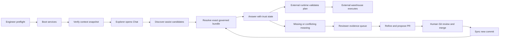

# Human-centered flows and service blueprints

This document turns the audit into proposed end-to-end journeys. The objective
is not to make Hyperset look like a generic analytics application; it is to make
the existing governance model effortless for humans to understand and operate.

## 1. Design principles

1. **State before action.** The user sees whether a dependency, context, source,
   or proposal is ready before being asked to act.
2. **Evidence at the decision point.** Provenance, freshness, authority, and
   uncertainty appear where a human decides to trust, refine, sync, or propose.
3. **One vocabulary across surfaces.** Use the same states in CLI, API, MCP,
   admin, review, and explorer: `ready`, `degraded`, `blocked`, `unknown`,
   `governed`, `observed`, `observed-only`, `stale`, `conflicting`, `unresolved`,
   and `no-match`.
4. **Safe defaults, explicit escape hatches.** Governed-only remains the default;
   observed-only exploration or raw diagnostics require a visible choice.
5. **Handoffs are first-class.** The user always knows who owns the next step:
   engineer, admin, connector steward, domain reviewer, Git owner, or external
   query runtime.
6. **Human approval remains outside Hyperset.** A proposal can be refined and
   opened as a PR, but only the customer Git workflow changes authority.

### 1.1 The front door should feel like a quiet Home, then Chat

The current Playground contains the right substrate, but the user-facing
experience should separate the quiet landing from the hosted agent thread. The
UX should make the first three jobs visible without making people choose a
persona before they can use the product:

| Regular-user job | Surface | First visible action |
| --- | --- | --- |
| Connect MCP / read docs | Get started | Choose a client, copy the config, or open the integration guide. |
| Start a conversation | Chat | Ask a natural-language question in a real thread. |
| Find a context bundle | Explore | Search governed meaning, then inspect concepts and the full graph. |

Context Review is a separate reviewer surface reached from a review assignment
or an “Ask a reviewer” action. Admin is not part of the regular-user primary
nav; it lives behind the profile menu and is visible only to admins.

The public shell should therefore have one persistent left rail with **New
chat**, **Home**, **Explore context**, recent threads, **Connect MCP**, personal
**Settings**, and **Help**. A reviewer sees **Review** when their account has
reviewer access or an assigned task. An admin sees protected **Admin /
workspace** only from the profile menu, alongside user and workspace controls.

Chat is intentionally narrow: it hosts a governed analyst, not a general agent
platform. The thread is also a reviewer tool when the reviewer discloses a
proposed-context comparison and asks the same question against a draft bundle.

## 2. End-to-end system flow



The key product change is to expose the edges that are currently implicit. A
user should never see a green answer without being able to tell whether the
flow stopped at discovery, exact resolution, observed corroboration, plan
validation, or external execution.

## 3. Flow A — Engineer setup and first governed success

### Goal

Move from clean checkout to one answer whose governed domain, exact commit,
evidence state, and next action are visible.

### Proposed journey

| Step | User sees | System behavior | Exit condition |
| --- | --- | --- | --- |
| 1. Preflight | Docker, ports, `.env`, `uv`, OpenAI credentials/models, disk/memory, and Git availability | Run checks without mutating data; show owner and recovery for each failure | All required checks are `ready` or an explicit local-only choice is accepted |
| 2. Boot | Named stages: database, migrations, demo sources, context seed, API, MCP | Stream stage progress and preserve logs/request IDs | Services are live; readiness is separate from liveness |
| 3. Verify context | Context source repo/ref/path, source ID, current commit, last sync, validation | Read current snapshot and show whether evidence is corroborated or awaiting sync | At least one domain is `ready` for exact resolution |
| 4. Configure runtime | Default agent/model, provider, embedding model, connector availability | Test the model and embedding path with a bounded probe | Runtime reports `ready` or gives a direct repair path |
| 5. First question | A copyable sample question and a clear “governed answer ready” banner | Run discover → resolve → answer; show phase and elapsed time | Answer has trust card and exact provenance |
| 6. Handoff | Links to explorer, admin, review, API/MCP recipes, and diagnostics | Keep the setup state available for later support | Engineer can reproduce the answer or export a redacted diagnostic bundle |

### Proposed state model

```text
checking → blocked / ready / degraded
booting → service-ready → context-syncing → answer-ready
                                      ↘ needs-admin
                                      ↘ needs-git-review
```

### Failure and recovery contract

| Failure | User-facing message | Primary action | Secondary detail |
| --- | --- | --- | --- |
| OpenAI runtime unavailable | “Configured model service is not reachable.” | Check credentials/provider and retry | Provider endpoint, model, and last check |
| Embedding model unavailable | “Discovery cannot rank context yet.” | Check the OpenAI embedding configuration and retry | Exact model and recovery command |
| API live, DB not ready | “API is up; governed data is not ready.” | Wait / inspect migrations | Liveness vs readiness explanation |
| Context path invalid | “The container cannot read this repository/path.” | Show container-visible path example | Repository/ref/path and file-count limit |
| Context sync failed | “Last valid snapshot remains in service.” | Retry sync / inspect error | Current serving commit and failed attempt |
| DataHub/Superset offline | “Answer may be governed but uncorroborated.” | Sync connection / continue with warning | Observed source and freshness state |
| Port collision | “Port 8000 is already in use.” | Choose port / show owning process | Exact Compose override |

### First-success acceptance criteria

- A clean-clone engineer can identify every blocked prerequisite before waiting
  through the entire boot.
- The first answer shows `governed`, `observed`, or another explicit resolution
  status rather than only “connected”.
- The answer shows Git repository/ref/path/commit and observed-source freshness.
- A failed sync never replaces the last valid context snapshot silently.
- The setup flow links to a copyable HTTP and MCP request for the same result.

## 4. Flow B — API/MCP integrator with a human-readable contract

### Goal

Let a human integrate Hyperset safely before writing production agent code. The
integrator should understand the three trust operations, see the exact request,
and learn what a consumer must do when Hyperset abstains.

### Proposed integration workspace

```text
Integrations
├── Quick start
├── HTTP
│   ├── Discover catalog
│   ├── Resolve exact context
│   └── Validate plan
├── MCP
│   ├── Streamable HTTP
│   └── stdio
├── Response anatomy
├── Error and recovery codes
└── Replay a request
```

The current API and MCP surfaces remain the contract. The proposed workspace is
a human-facing guide and replay console, not a new semantic authority.

### Proposed request sequence

1. **Discover.** Send the ordinary question to assist-class discovery. The UI
   labels ranked candidates as hints, not governed identity.
2. **Choose.** Let the human inspect candidate domain/concept names and choose
   the exact bounded directive. If none fit, offer “No governed match” rather
   than forcing a candidate.
3. **Resolve.** Call `resolve_analytics_context` with the exact directive.
4. **Inspect.** Display `resolution.status`, Git provenance, observed versions,
   warnings, conflicts, and required rules in a readable response card.
5. **Validate.** Send the proposed analytical plan to
   `validate_analytics_plan`. Label success as “plan conforms to governed rules,”
   never “query validated” or “query executed.”
6. **Execute externally.** The customer's warehouse/query tool runs the query.
   The integrator records the bundle ID, commit, plan validation result, and
   external execution metadata.

### Response card proposal

```text
RESOLUTION STATUS  GOVERNED WITH WARNINGS

Domain         revenue
Concept        recognized_revenue
Authority      Git · main · abc1234 · domains/revenue
Observed       Superset awaiting sync · 0 corroborated versions
Warnings       3 refs awaiting sync
Required       region join · recognized filter · monthly grain

[Copy HTTP] [Copy MCP] [Replay] [Open review task]
```

### Human-facing API/MCP error states

| Code/state | Meaning | Safe consumer behavior | Human action |
| --- | --- | --- | --- |
| `no_match` | No governed domain/concept answers the directive | Do not present as governed; ask for clarification or open a review task | Refine question or create meaning |
| `observed_only` | Source evidence exists without governed authority | Label as observed; do not silently promote | Ask reviewer/author to establish meaning |
| `stale_bundle` | The requested bundle/version is no longer current | Do not execute against it without an explicit policy | Re-resolve and compare commits |
| `conflicting` | Governed and observed evidence disagree | Surface conflict and block unsafe automation | Inspect evidence and route to owner |
| `ref_awaiting_sync` | Git reference is valid but source corroboration is pending | Use governed meaning with visible warning if policy allows | Run connection sync |
| `invalid_plan` | Proposed plan violates required rules | Do not execute; return violation codes and recovery | Fix fields, joins, filters, or grain |
| `unverifiable` | Plan/result cannot be checked against current evidence | Treat as unknown, not valid | Refresh bundle/source or escalate |

### HTTP/MCP parity checklist

- Same operation names, input semantics, response fields, status vocabulary, and
  error codes across HTTP and MCP.
- Copyable examples include request ID, bundle ID, commit, and version.
- MCP Inspector setup explicitly names `http://localhost:8010/mcp` and stdio
  fallback.
- No request requires a browser secret; credentials remain server-side.
- A replay action is read-only and states whether it calls live services or a
  pinned fixture.
- An unknown response code fails closed in the sample client.

## 5. Flow C — Admin operations and write-back setup

### Proposed sequence

```text
Readiness → Context sources → Connections → Models → Review write-back → Diagnostics
```

1. **Readiness.** Show local/authenticated posture, API, Postgres, model,
   embedding, and service health. Separate “available connector type” from
   “configured connection.”
2. **Context sources.** Show repository, ref, path, source ID, current commit,
   last attempt, validation, and serving snapshot. Provide `sync now` only as a
   read/observe operation that preserves Git authority.
3. **Connections.** Show Superset/DataHub endpoints, credential source,
   configured/connected state, last check, sync status, and recovery.
4. **Models.** Show provider, model, embedding model, default selection, and a
   bounded test. Never echo a secret.
5. **Review write-back.** Configure repository/ref/path and token source; test
   access; show that the action creates a proposal PR and never merges.
6. **Diagnostics.** Export a redacted state bundle with timestamps, versions,
   request IDs, current commit, and safe recovery commands.

### Admin guardrails

- The page says “local-only” or displays the authenticated identity; `admin
  only` is not sufficient.
- Save is disabled with an explanation, not just because a button is grey.
- `Test connection` never creates a PR or changes Git.
- Sync failure explains what snapshot continues to serve.
- A configured write-back target is not described as the context authority.

## 6. Flow D — Reviewer evidence to Git proposal

### Proposed sequence

1. **Queue.** Load server-authoritative actionable tasks. Filter by domain, age,
   owner, severity, confidence, stale, conflict, duplicate, and status.
2. **Why.** Start with the triggering question, the missing/ambiguous concept,
   and the processor rule that created the task.
3. **Evidence.** Separate governed, observed, proposed, conflicting, and missing
   evidence. Show source IDs, versions, timestamps, freshness, and affected
   assets.
4. **Diff.** Show current Git definition and proposed definition side by side or
   as a unified diff with repository/ref/path/commit.
5. **Disposition.** Choose refine, needs evidence, duplicate, defer, assign, or
   propose. Capture rationale where the choice affects queue state.
6. **Concurrency.** Save with task version/ETag. If changed by someone else,
   show the new version and preserve the reviewer's draft.
7. **Proposal.** Run a preflight, create a new branch/PR, and show URL, branch,
   commit, checks, and next human action.
8. **Aftercare.** Track PR opened/updated/merged/closed and the subsequent
   context sync. Never show “approved” until the external Git merge exists.

### Reviewer decision card

```text
WHY THIS EXISTS
Question: Which source and rules apply to recognized revenue by region?
Finding: undefined concept · confidence: medium · rule: missing_context_v1

EVIDENCE
Governed: revenue domain @ Git abc1234
Observed: Superset dataset @ version 42 · last sync 2d ago
Conflict: observed expression differs from governed filter

PROPOSED CHANGE
domains/revenue/manifest.yaml · 4 additions · 1 changed join

[Needs evidence] [Defer] [Edit draft] [Propose PR]
```

## 7. Flow E — Explorer question to trustworthy answer

### Proposed sequence

1. **Ask.** Keep one conversational composer. Governed-only is on by default.
   The header's Run settings control exposes a configured analyst profile,
   model/provider, and next-message context policy without turning the regular
   surface into an agent builder. Context search is labelled as discovery; a
   selected bundle is shown with its repository, ref, commit, and snapshot
   before it is used in the thread.
2. **Readiness.** If the deployment is not ready, explain whether the user
   should wait, retry, or ask an admin.
3. **Progress.** Show queue position, current phase, elapsed time, and a soft
   timeout. Use `Ready` for backend health and `Working` only for an active turn;
   never show “Streaming” when no turn is running.
4. **Resolve.** Show the exact domain/concept, authority, commit, source
   versions, and warnings before the answer is treated as trustworthy.
5. **Answer.** Provide the answer plus a compact trust row and qualifiers. Stamp
   the response with the requested policy, effective trust state, agent,
   provider/model, bundle, and authority commit; prior messages remain
   unchanged if Run settings change.
6. **Recover.** No-match, observed-only, stale, conflict, invalid plan, timeout,
   and user-stop states each offer the correct next action.
7. **Handoff.** Let the user inspect evidence, copy a reproducible API/MCP call,
   or open a review task without leaving the transcript.

### Explorer state table

| State | Primary copy | Required action |
| --- | --- | --- |
| Ready | “Ready to resolve governed context.” | Ask a question |
| Working | “Discovering governed context · 18s” | Wait, stop, or inspect phase |
| Governed | “Governed answer · Git abc1234” | Trust with provenance |
| Governed with warnings | “Governed definition; source corroboration pending” | Continue cautiously or sync |
| Observed-only | “Observed source; no approved meaning” | Do not treat as governed; review |
| No match | “No governed context answered this question” | Refine or open review |
| Conflict | “Governed and observed evidence disagree” | Inspect conflict; avoid unsafe action |
| Stale | “This bundle is stale” | Re-resolve |
| Stopped | “Stopped by you after 18s” | Retry or refine |
| Timeout | “This took longer than the safe limit” | Retry, inspect diagnostics, or ask admin |

## 8. Flow F — Quality/evaluation loop

1. Select a pinned question set, model/provider, context commit, and source
   versions.
2. Run no-context discovery and governed-context comparison as separate arms.
3. Show answer quality, source selection, prohibited-source avoidance, plan
   validation adherence, provenance completeness, and safe abstention.
4. Label recorded versus live runs and show expected failures.
5. Link every failure to an owner: context author, connector steward, runtime
   integrator, or product engineer.
6. Feed unresolved gaps into reviewer tasks, not a hidden score only.

## 9. Cross-surface handoff contract

| From | To | Payload that must survive |
| --- | --- | --- |
| Setup | Explorer | Readiness, default agent/model, context commit |
| Explorer | API/MCP | Question, directive, bundle ID, commit, warnings |
| Explorer | Reviewer | Triggering question, missing concept, evidence, request ID |
| Admin | Reviewer | Write-back readiness, repo/ref/path, proposal capability |
| Reviewer | Git | Exact diff, rationale, evidence, owner, task ID |
| Git | Hyperset | Merged commit, sync result, new snapshot ID |
| Hyperset | Evaluator | Bundle/provenance, source versions, trace, terminal state |

If one of these payloads is lost, the user should see a visible “provenance
incomplete” state rather than a clean-looking success.
