# Hyperset v1 page map and persona flows

Status: proposed end-of-v1 experience. The local v0 shell is implemented as a
smaller, testable navigation slice; see [ADR 0038](../adr/0038-playground-review-settings-navigation.md)
for the current product decision and the boundary between shipped behavior and
the v1 target described here.
Audience: product, design, engineering, platform, and domain stewards
Companion artifacts: [page mockups](mockups/v1/README.md)
Review record: [ChatGPT reference and adversarial review](chatgpt-reference-and-adversarial-review.md)

This is the page-level answer to “where does each person go, what do they do,
and who owns the next step?” The mockups are intentionally separate files so a
team can review one page, one role, and one state at a time.

## The v1 product promise

Hyperset should make governed meaning usable without making every user learn
the system architecture first.

At the end of v1:

- an Explorer lands on a quiet Home, opens a real Chat thread, searches context
  bundles, and can connect MCP or read docs;
- a Context reviewer gets a focused task, inspects evidence, refines meaning,
  and proposes a GitHub PR without becoming an admin;
- an Admin / context steward enters a protected settings area to manage context
  sources, users, integrations, readiness, and policy;
- an explorer can distinguish a governed answer, observed corroboration,
  abstention, and stale or conflicting result;
- an agent can detect a meaning gap and prepare a review task, but cannot silently
  change governed authority;
- GitHub remains the authority for approval and merge; Hyperset syncs the merged
  commit back into the serving snapshot;
- any regular user can connect an MCP client or read the docs without entering
  Admin;
- advanced traces and maintenance tools remain available, but do not compete
  with the three human product jobs.

## Minimal surface rule

Every v1 page has one primary job and one primary action. The default view shows
only the state needed to make that decision; provenance, raw payloads, routing
rules, diagnostics, and implementation detail sit behind an explicit
“details” disclosure or a protected settings page.

For an executive or occasional user, the default answer is intentionally small:
what is the state, what decision is needed, who owns it, and what happens next.
Raw graph metadata, model names, request IDs, and policy mechanics are useful
when investigating a problem, but they are not homepage content.

The Explorer’s graph is the exception to the one-card rule because exploration
is the job: the full graph remains visible, with search, domain filtering, node
selection, and a compact selected-node explanation. It should feel like a map,
not a dashboard of repeated status cards.

## Information architecture

```text
Hyperset
├── Get started
│   ├── Connect MCP
│   ├── Read docs / API recipes
│   └── Login and invite
├── Home (default regular-user landing)
│   ├── Open Chat
│   ├── Connect MCP / read docs
│   └── Find a context bundle
├── Chat
│   ├── Thread history
│   ├── Governed answer and trust state
│   └── Reviewer context test (disclosed)
├── Explore
│   ├── Context catalog
│   ├── Context graph
│   └── Provenance / source history
├── Review (reviewer access or deep link)
│   ├── Queue
│   ├── Task detail
│   ├── GitHub proposal
│   └── Notifications / Slack
└── Admin / workspace (protected profile menu)
    ├── Overview and readiness
    ├── Context sources
    ├── Users and roles
    ├── Connections and models
    ├── Write-back / notification policy
    └── Audit and diagnostics
```

## Persona-to-page map

| Persona | Job to be done | Entry page | Must never be asked to know first |
| --- | --- | --- | --- |
| Explorer / general question asker | Chat, inspect trust, find context bundles, connect MCP, read docs | Home / Chat / Get started / Explore | Git workflow, admin settings, or raw connector internals |
| Context reviewer | Resolve ambiguity and propose a governed meaning change | Review queue or review deep link | Workspace setup or user management |
| Admin / context steward | Configure context, users, integrations, readiness, and policy | Protected Admin / workspace profile menu | Semantic review details before routine admin work |
| Git owner | Approve and merge governed changes | GitHub PR linked from Hyperset | Reconstructing the original question |
| Agent | Discover, draft, and notify | Background/API/MCP actor | Silent authority changes |

## Route decisions

The v1 target described here keeps role-specific destinations behind role-aware
navigation. OIDC login/session and role authorization are shipped but
present-but-default-off; the reviewed per-principal grant source and full ACL
policy remain. The current local v0 shell is intentionally more discoverable: the
Playground user nav exposes Home, New chat, Explore context, Recent threads,
Docs, Help, Profile, Review, and Settings. Playground diagnostics use one
dropdown, and Settings uses one dropdown whose selection maps to an
`/admin/<tab>/` route. Visibility in this local shell is not authorization;
protected APIs remain the security boundary. This distinction prevents the
mockups and route map from being mistaken for evidence that every identity,
grant-policy, invite, workspace, or admin capability already works.

| User says… | Route | First action | Success signal |
| --- | --- | --- | --- |
| “I want to ask a question.” | Chat | Open or continue a thread | Answer has a visible trust state |
| “I want to explore context.” | Explore | Search for a context bundle | Concepts, relationships, and provenance are legible |
| “I want to connect MCP or read docs.” | Get started | Choose client, transport, and docs path | First test call or copied recipe succeeds |
| “I need to review meaning.” | Review | Open assigned task or deep link | Reviewer can disposition or propose |
| “I manage this workspace.” | Admin / workspace via profile menu | Check readiness or users/context | Routine configuration is complete without CLI |

## Page catalog and end-state criteria

### 1. Home / Explorer landing

Mockup: [home-role-router.html](mockups/v1/home-role-router.html)

The default home is intentionally quiet and composer-led. It gives a user one
clear primary action — start a question — and two quiet secondary paths for
MCP/docs and context-graph exploration. It does not expose a dashboard of
status cards, the chat transcript, graph internals, reviewer work, or admin
status until the user chooses that job.

Admin is intentionally absent from the primary nav. It appears under the
workspace/avatar menu only for admins. Review appears for reviewer accounts or
through an assigned-task link.

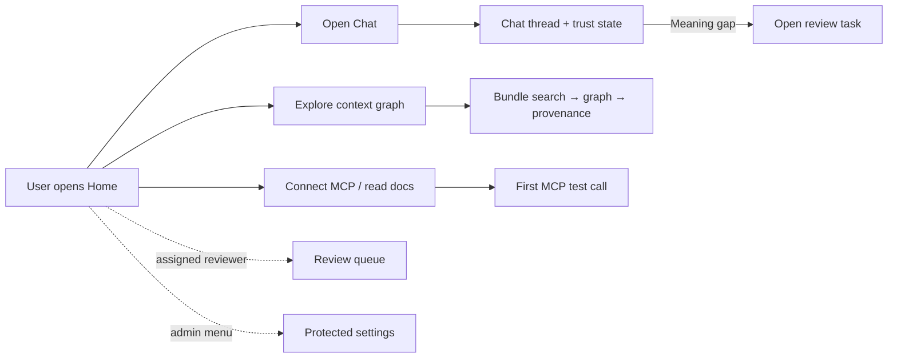

### 2. Chat thread and trust state

Mockup: [playground-chat-thread.html](mockups/v1/playground-chat-thread.html)

Chat is the main working surface for a general user. Hyperset is not positioned
as a general-purpose chat platform; it hosts one governed analyst thread so the
user can ask a question, see which context bundle shaped the answer, and take a
safe next step. The thread keeps the conversation primary and makes provenance,
warnings, and review handoff compact.

The same thread supports reviewer validation. A reviewer can disclose “Preview a
proposed context update,” ask the original question against an ephemeral draft,
and compare the result before deciding whether a GitHub proposal makes sense.
The draft must say “not serving” throughout the preview. This is a test of
meaning, not an approval shortcut.

The Chat header has one compact **Run settings** control. It is the place to
choose a configured analyst profile when the workspace exposes more than one,
choose the available model/provider, and choose the context policy for the next
message. `Governed only` is the default and means “answer from Git-owned
context.” `Governed + observed` means connected-system evidence may be included;
it does not promote that evidence to authority. Context-bundle search remains a
separate action from policy selection.

Settings apply to the next message in the current thread. Every assistant
message keeps an immutable stamp of its agent, provider/model, requested policy,
effective trust state, bundle ID, and authority commit. Changing the header
control never rewrites earlier answers; starting a new thread returns to
workspace defaults.

End-of-v1 is complete when a user can start a thread, understand the answer's
trust state without reading raw JSON, open the relevant context bundle, and
continue the conversation. A reviewer can run the same question against a draft
context without changing the serving snapshot.

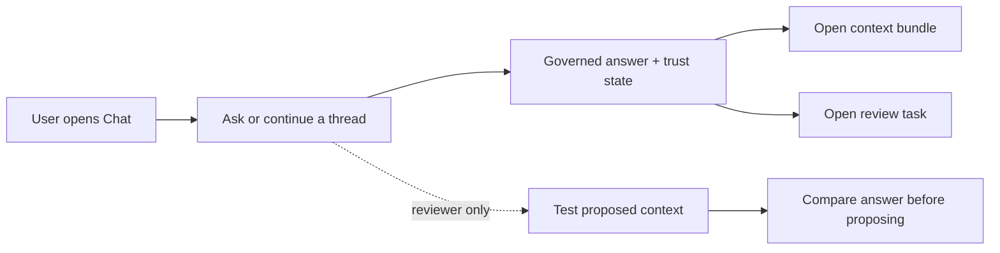

### 3. Login, invite, and workspace selection

Mockup: [login-and-invite.html](mockups/v1/login-and-invite.html)

Login is a role-neutral OIDC gate. The user authenticates once, accepts an invite
if one exists, chooses a workspace when needed, and then returns to the originally
requested task. A loopback developer demo may continue with authentication off,
but that is an identity-free bypass, not a Hyperset local account or credential
login.

End-of-v1 is complete when a reviewer who clicks a Slack or GitHub deep link
lands on the exact task after authentication, and when an invited user knows
which workspace and role they are joining before accepting.

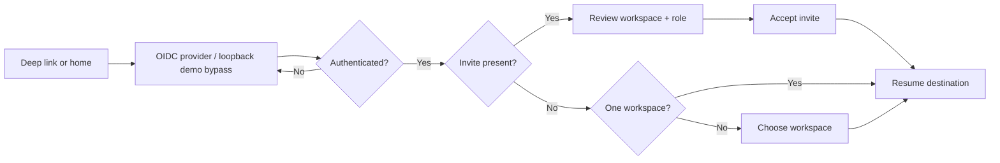

### 4. Admin overview and readiness

Mockup: [admin-overview.html](mockups/v1/admin-overview.html)

This is the operational home for an administrator. It answers “can humans use
this now?” before exposing detail. Each readiness item names its owner, impact,
last check, and recovery action.

End-of-v1 is complete when an admin can get from a failed readiness item to the
right configuration page or diagnostic command without leaving the product.

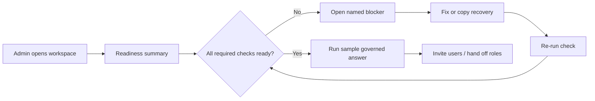

### 5. Admin context sources

Mockup: [admin-context-sources.html](mockups/v1/admin-context-sources.html)

The context page makes Git authority concrete: repository, ref, path, source
ID, last serving commit, sync state, and validation result. It distinguishes a
failed sync from an unavailable snapshot and never replaces a valid snapshot
silently.

End-of-v1 is complete when an admin can add, test, sync, pin, and roll back a
context source while understanding what commit is currently served.

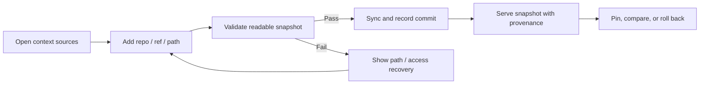

### 6. Admin connections and models

Mockup: [admin-connections-and-models.html](mockups/v1/admin-connections-and-models.html)

This page owns observed-system connectors, embedding, and answer runtime
dependencies. It makes the difference between liveness and readiness visible.
Secrets are referenced by a secret name or environment binding; they are never
rendered back into the page.

End-of-v1 is complete when the admin can test a connector, embedding path, and
agent runtime independently and see which user experiences are degraded by a
failure.

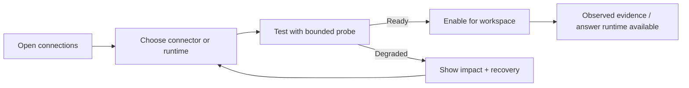

### 7. Admin write-back, users, and notification policy

Mockup: [admin-writeback-settings.html](mockups/v1/admin-writeback-settings.html)

This page is the policy boundary. It configures the Git repository/branch,
reviewer groups, Slack destination, notification triggers, and whether an agent
may open a PR automatically. The safe v1 default is proposal-only: the agent
may create a task and draft, but a human action is required to open a PR.

End-of-v1 is complete when a workspace can explain who gets notified, what the
agent is allowed to do, and which system is authoritative for final approval.

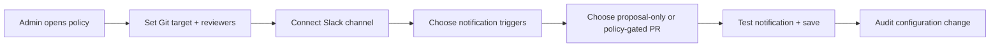

### 7.1 Admin users and roles

Mockup: [admin-users.html](mockups/v1/admin-users.html)

User management belongs with the Admin / context steward persona. It should
not be a separate public persona or a reviewer responsibility. The settings
area manages Explorer access, reviewer routing, admin access, pending invites,
and the fallback governance group.

End-of-v1 is complete when an admin can invite a person, assign the minimum
role they need, route review tasks by domain, and understand why a regular user
cannot see Admin / workspace.

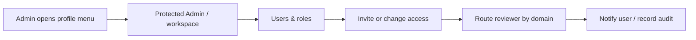

### 8. Reviewer queue

Mockup: [reviewer-queue.html](mockups/v1/reviewer-queue.html)

The queue is a work list, not an agent transcript. Each task shows the user
question, affected concept/domain, urgency, evidence count, draft status, and
the next action. Empty, blocked, and stale states are designed—not treated as
blank screens.

End-of-v1 is complete when a reviewer can scan, filter by ownership or urgency,
open the right task, and understand why it needs a human.

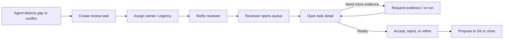

### 9. Reviewer task detail, preview, and GitHub proposal

Mockup: [reviewer-task-and-github.html](mockups/v1/reviewer-task-and-github.html)
Preview: [reviewer-context-preview.html](mockups/v1/reviewer-context-preview.html)

The task detail joins the original question, the agent's reason, observed
evidence, governed context, unresolved uncertainty, and the exact proposed diff.
Before the mutation handoff, the reviewer can run a read-only preview against
an ephemeral overlay. The preview shows current versus proposed meaning, the
semantic delta, representative questions, regression checks, and the serving
commit that remains authoritative. Only then can the reviewer explicitly choose
“Open GitHub proposal.” A GitHub PR contains the task ID, evidence summary,
exact diff, preview results, source commit, and backlink.

End-of-v1 is complete when a Git owner can review the PR without reconstructing
the conversation, and when the merged commit can close the task and update the
serving snapshot.

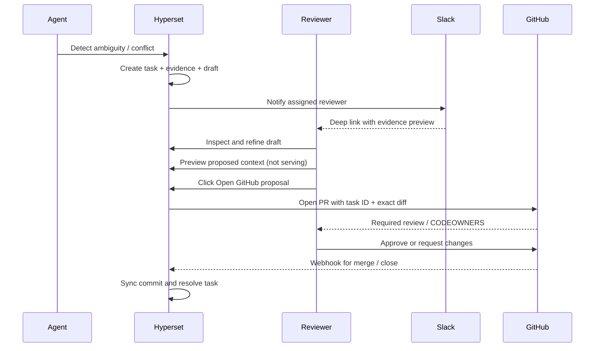

#### The explicit v1 answer: does the agent do the review?

No. The agent can do the preparation work:

1. detect an unresolved or conflicting meaning;
2. create a review task with a concise question;
3. gather typed evidence and provenance;
4. draft a candidate change and explain uncertainty;
5. notify the assigned reviewer in Slack;
6. optionally open a PR only when an administrator enables a policy-gated mode.

The human still reviews the meaning. GitHub remains the approval and merge
authority. Slack is the notification and triage surface. Hyperset is the
evidence, draft, and synchronization surface. An agent must not auto-merge or
silently mutate governed authority in v1.

### 10. Reviewer notifications and Slack

Mockup: [reviewer-notifications.html](mockups/v1/reviewer-notifications.html)

Slack is connected by an admin, then used for focused notifications—not as a
second source of truth. A notification contains the task title, why the person
was selected, urgency, a compact evidence preview, and a deep link to Hyperset.
When a PR exists, the message adds the GitHub PR link and current review state.

End-of-v1 is complete when a reviewer can get from Slack to the exact task,
choose a disposition, and see whether the task is waiting on evidence, human
review, GitHub review, or sync.

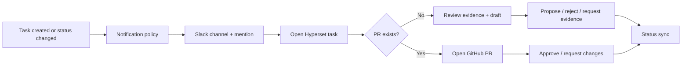

### 11. Context bundle explorer

Mockup: [context-explorer.html](mockups/v1/context-explorer.html)

The bundle explorer is a regular-user exploration surface, not an admin diagnostic and
not a second semantic authority. The entire workspace graph stays visible; an
Explorer can search bundles and nodes, filter by domain, select a node, inspect
its compact definition and source identity, and return to Chat with a more
precise question. A reviewer can use the same screen to verify the relationships
behind a proposed context update.

End-of-v1 is complete when a user can answer “what does this concept connect to,
which source defines it, and what should I ask next?” without opening raw JSON.

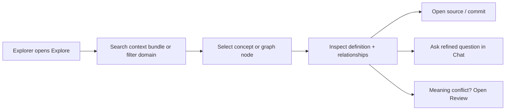

### 12. New user MCP setup wizard

Mockup: [mcp-setup-wizard.html](mockups/v1/mcp-setup-wizard.html)

The wizard teaches the transport choice, shows the endpoint, gives a safe
copyable config, tests the connection, and completes one discover → resolve
call. It explains that MCP exposes Hyperset's contract; it does not turn MCP
into a hidden write path.

End-of-v1 is complete when a new user can finish setup in one sitting and can
tell whether a failed test is authentication, network, endpoint, or context
readiness.

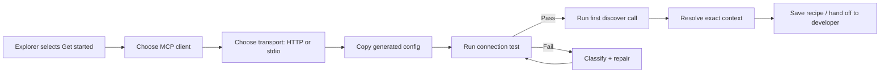

### 13. API/MCP integration console

Mockup: [api-mcp-integration.html](mockups/v1/api-mcp-integration.html)

The integration console is a human-readable contract browser. It shows the
three operations, request/response anatomy, provenance fields, abstention
behavior, and a replayable example. It explicitly says that external systems
execute queries; Hyperset validates plans and context.

End-of-v1 is complete when an integrator can copy a working request and write a
consumer that handles `unresolved`, `stale`, `conflicting`, and `observed-only`
without guessing.

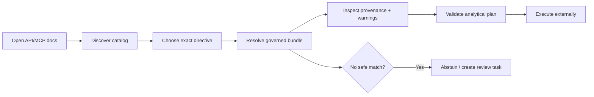

### 14. Evaluator and maintainer

Mockup: [evaluator-and-maintainer.html](mockups/v1/evaluator-and-maintainer.html)

The maintainer surface is for regression, sync, readiness, and diagnostics. It
does not compete with the explorer. It turns “it feels stuck” into a bounded
timeline with request IDs, dependency checks, and a safe redacted export.

End-of-v1 is complete when an operator can distinguish a product regression
from a missing model, stale context, connector outage, or invalid user input.

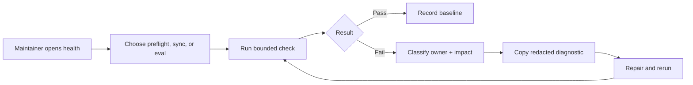

## Cross-surface handoffs

| Handoff | Origin | Destination | Required payload |
| --- | --- | --- | --- |
| New user → admin | Explorer blocked by readiness | Admin overview | Workspace, failed check, request ID |
| Explorer → reviewer | Unresolved/conflicting meaning | Review task | Question, candidate concepts, evidence, provenance |
| Reviewer → GitHub | Human clicks Propose to Git | PR | Task ID, exact diff, evidence, source commit, backlink |
| GitHub → Hyperset | Merge webhook | Context sync/task closure | Repository, ref, commit, PR ID, task ID |
| API/MCP → reviewer | Consumer cannot safely resolve | Review task | Request, selected candidates, abstention reason |
| Maintainer → support | Repeated failure | Diagnostic bundle | Redacted config, stage timeline, logs/request IDs |

## Permissions and authority

| Capability | Explorer | Reviewer | Admin | Git owner | Agent |
| --- | ---: | ---: | ---: | ---: | ---: |
| Ask / discover / resolve | Yes | Yes | Yes | Link-only | Yes |
| See evidence and provenance | Yes | Yes | Yes | In PR | Yes, scoped |
| Create review task | Yes, explicit | Yes | Yes | No | Yes |
| Edit draft proposal | No | Yes | Optional | No | Draft only |
| Configure connections/policy | No | No | Yes | No | No |
| Open PR | No | Yes, explicit | Policy setting | Yes | Optional, policy-gated |
| Approve / merge governed change | No | No by default | No by default | Yes | No |
| Sync merged context | No | No | Yes / service | No | Service action |

## Navigation visibility rules

| Surface | Explorer sees | Context reviewer sees | Admin sees |
| --- | --- | --- | --- |
| Primary navigation | Home · Chat · Explore · Get started | Home · Chat · Explore · Get started · Review | Home · Chat · Explore · Get started · Admin menu |
| Account/workspace menu | Account, sign out | Account, assigned reviews, sign out | Admin / workspace, users, workspace switch, sign out |
| Review | Only from an assignment or explicit reviewer access | Directly | Directly if the admin also has reviewer access |
| Advanced Chat tools | Opt-in disclosure | Opt-in disclosure | Opt-in disclosure |

This keeps the everyday product legible: a regular user does not need to know
that Admin exists, while a reviewer can still act quickly from a task deep link.

## Notification contract

Notifications use one state vocabulary and always include the next owner.

| Event | Primary channel | Link | Recipient |
| --- | --- | --- | --- |
| Review task created | Slack | Hyperset task | Assigned reviewer / group |
| Evidence requested | Slack | Hyperset task | Task owner |
| PR opened | Slack + GitHub | Hyperset task + PR | Reviewer + CODEOWNERS |
| PR changes requested | Slack + GitHub | PR | PR author/reviewer |
| PR merged | Slack, optional | Hyperset task + commit | Admin/reviewer |
| Sync failed after merge | Slack + admin inbox | Sync run | Admin / maintainer |
| Readiness degraded | Admin inbox, optional Slack | Settings check | Admin / maintainer |

## End-of-v1 acceptance checklist

- [ ] Every page has a plain-language role label and a route back to Home, Chat,
  Explore, or the protected workspace menu.
- [ ] Login preserves the original deep link through invite and workspace
  selection.
- [ ] Admin settings are real settings—not only a runtime form hidden under an
  operations label.
- [ ] Slack messages deep-link to Hyperset; GitHub PRs deep-link back to the
  task and carry the evidence needed for approval.
- [ ] Agents may prepare and notify, but cannot silently approve or merge.
- [ ] MCP setup identifies transport, endpoint, auth, test result, and first
  governed call.
- [ ] Explorer progress has a terminal success, abstention, timeout, and error
  state with a next action.
- [ ] All state transitions show owner, provenance, and request/task IDs.
- [ ] A reviewer can understand the question and exact diff without reading an
  agent transcript.
- [ ] A maintainer can export a redacted diagnostic bundle and reproduce a
  failure with a bounded command.
