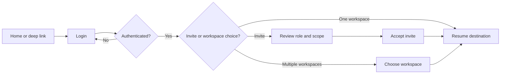
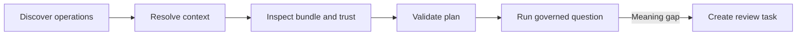
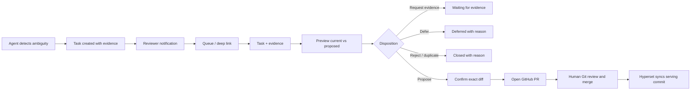
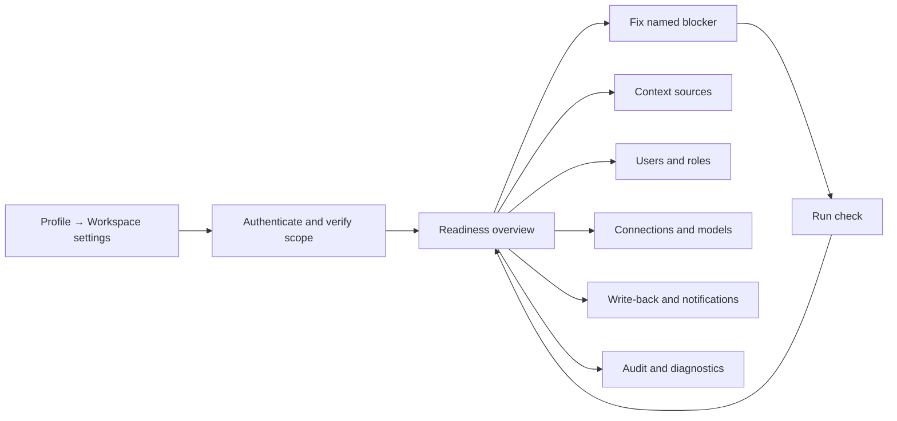

# Hyperset v1 product UX specification

Status: source of truth for v1 design and implementation
Audience: product, design, engineering, agents, reviewers, admins, and evaluators
Scope: human-facing product surfaces, API/MCP onboarding, role boundaries, and usability acceptance

This document defines the intended product. The HTML files in
[mockups/v1](mockups/v1/README.md) are visual references for the page contracts
below. They are not a substitute for the route, state, permission, and
accessibility rules in this specification.

## 1. Product promise and boundaries

Hyperset makes governed meaning usable by people and agents without making
every user learn the implementation first.

The product has four non-negotiable boundaries:

1. Git-owned context is the serving authority.
2. Connected systems provide observed evidence, not silent authority.
3. Agents may answer, discover gaps, draft changes, and notify humans; they may
   not approve or merge governed meaning.
4. GitHub remains the approval and merge system. Hyperset records the proposal,
   links the PR, and syncs the merged authority back into the serving snapshot.

Hyperset is not a generic chat product, SQL editor, Git approval system, or
secrets-management console. The chat exists to host a governed analyst
experience; Explore exists to make context legible; Admin exists to operate the
workspace.

## 2. Personas and authorization model

| Role | Primary job | Default entry | Can do | Cannot do |
| --- | --- | --- | --- | --- |
| Anonymous visitor | Understand the product and decide how to start | Public Home | Read product/docs, open Login, view public setup guidance | Ask governed questions or access workspace data |
| Explorer / question asker | Ask a question, understand trust, find context, connect MCP | Home → Chat | Use Chat, Explore, MCP setup, personal settings | Edit governed definitions, see Admin, approve a proposal |
| Context reviewer | Resolve ambiguity and propose a meaning change | Review queue or deep link | Inspect evidence, preview a draft, request evidence, defer, reject, propose a PR | Change workspace configuration, approve/merge GitHub |
| Admin / context steward | Keep workspace ready and manage people, sources, integrations, and policy | Profile → Workspace settings | Configure workspace, readiness, users, roles, routing, sources, connections, write-back | Approve semantic meaning merely by being an Admin |
| Git owner | Approve and merge a governed change | GitHub PR link | Review and merge the PR in GitHub | Treat an agent or Hyperset UI as the merge authority |
| Agent / MCP client | Resolve context and prepare useful work | API/MCP | Discover, resolve, validate, answer, draft review tasks, notify | Mutate serving authority, approve, merge, or impersonate a human |

Role labels are not authorization. Every read and mutation is enforced
server-side. UI hiding is only a discoverability choice.

## 3. Information architecture

```text
Public
├── Home
├── Login / Accept invite
└── Get started
    ├── Connect MCP
    ├── API recipes
    └── Documentation

Authenticated regular user
├── Chat
├── Explore context
├── Recent threads
├── Personal settings
└── Help

Reviewer access
└── Review
    ├── Queue
    ├── Task + evidence
    ├── Context preview
    ├── GitHub proposal handoff
    └── Notifications

Admin access, behind the profile/workspace menu
└── Workspace settings
    ├── Overview / readiness
    ├── Context sources
    ├── Users and roles
    ├── Connections and models
    ├── Write-back and notifications
    └── Audit / diagnostics
```

The regular-user shell has one persistent navigation model:

- Home
- New chat
- Explore context
- Connect MCP / docs
- recent threads
- Help
- profile menu

The profile menu may contain Personal settings for everyone and Workspace
settings only for authorized Admins. Review appears for reviewers and for
assigned deep links. Admin is never a primary regular-user nav item.

## 4. Route and page contracts

Every page has one job, one primary action, and one success signal. It may have
secondary actions, but it must not present a dashboard of unrelated work.

| Page | Audience | Primary action | Success signal | Advanced content |
| --- | --- | --- | --- | --- |
| Home | Anonymous and authenticated | Start a question | Chat opens with a focused composer | Docs, Explore, and role-specific links |
| Login / invite | Unauthenticated or invited user | Authenticate / accept invite | User returns to the intended destination | Provider and security detail |
| Chat | Explorer, reviewer preview | Send a question | Answer has trust and provenance | Trace, raw bundle, policy mechanics |
| Explore | Explorer, reviewer | Find a context bundle/node | Selected context is understood or handed to Chat | Raw graph payload, source metadata |
| MCP setup | Integrator / Explorer | Copy and verify connection recipe | Client can perform the first request | Transport details, response anatomy |
| Review queue | Reviewer | Open next task | Queue state and ownership are clear | Filters, audit, raw IDs |
| Review task | Reviewer | Preview proposed context | Current/proposed meaning and evidence are comparable | JSON, processor trace |
| Proposal handoff | Reviewer | Create GitHub PR | PR URL, branch, commit, and next owner are recorded | Exact patch and API response |
| Admin overview | Admin | Run readiness checks | Blockers have owners and recovery paths | Dependency payloads and diagnostics |
| Admin users | Admin | Invite / change role | Access and routing are explicit and audited | Identity provider metadata |
| Admin sources | Admin | Validate and sync source | Serving commit and sync state are explicit | Manifest and raw sync logs |
| Admin connections | Admin | Test connection | Reachability, freshness, and impact are visible | Connector metadata and logs |
| Admin policy | Admin | Save policy | Write-back and notification rules are explicit | JSON configuration |

### 4.1 Home

Home is the generic landing page. It must work for a person who does not know
whether they are an Explorer, reviewer, or Admin.

Default content:

- Hyperset identity and one sentence explaining governed context.
- One primary “Ask Hyperset” / “Start a question” action.
- Quiet secondary links: “Explore context” and “Connect MCP / read docs.”
- Login when anonymous; profile/workspace menu when authenticated.

Do not put Admin, review queues, model selectors, node counts, connector health,
or implementation terms on Home. A role-aware user may see a small “Review
assigned work” or “Workspace settings” link after authentication, but never as
the dominant landing content.

### 4.2 Login, invite, and workspace selection

Login is role-neutral. It uses the deployment's configured OIDC provider and
returns the user to the original destination after success. Hyperset does not
store local usernames/passwords or provide an email credential login.

Invite acceptance shows, before confirmation:

- workspace name;
- invited email/identity;
- role and domain scope;
- who invited the user;
- what the role can and cannot do.

The loopback demo may bypass authentication while the gate is off. That bypass
must be visibly labelled local-only; it is not a login mode, provides no
identity, and cannot be used on a network-exposed deployment.



### 4.3 Chat

Chat is the primary working surface after Home. It is a real thread, not a
single question form.

The default view contains:

- thread title or generated title;
- messages and clear user/assistant distinction;
- a composer with an explicit accessible label;
- a compact Run settings disclosure;
- a compact trust/provenance row on every assistant answer.

Run settings contains only:

- configured agent/profile;
- configured model/provider;
- context policy: **Governed only** (default) or **Governed + observed**;
- a sentence saying the choice applies to the next message.

Every answer stores and displays an immutable run stamp:

```text
Agent · provider/model · requested policy · effective trust · bundle ID · authority commit
```

Changing settings never rewrites earlier answers. A governed-only request that
cannot resolve governed context fails closed and explains the next safe action.
An observed result is labelled observed, stale, conflicting, or non-governed as
appropriate; it is never visually equivalent to governed authority.

The reviewer-only “Preview proposed context” disclosure runs the same question
against an ephemeral draft. It must say “Draft only — not serving” in the
preview, answer, and proposal handoff states.

### 4.4 Explore context

Explore is a read-only map of meaning. It is not a raw developer graph viewer.

Required interaction:

1. Search or choose a domain.
2. Choose a concept or inspect all matching context.
3. Load the graph from the real catalog/resolver.
4. Search across node label, kind, domain, and description.
5. Select a node from the graph or results list.
6. Read a plain-language description, kind, domain, and provenance summary.
7. Open the context in Chat or return to the search.

The graph must be explorable and searchable, with keyboard-accessible nodes,
visible selected state, bounded horizontal containment on small screens, and a
matching results list. Raw payloads and request IDs sit behind “View details.”
The UI must distinguish an empty catalog, failed catalog, empty graph, failed
resolve, and no matching search result.

### 4.5 MCP setup and API onboarding

MCP setup is a short wizard, not a generic developer dashboard.

1. Choose client: Claude Desktop, Cursor, or Custom MCP client.
2. Choose transport: Streamable HTTP or stdio.
3. Show the exact endpoint/command and generated config.
4. Copy the recipe with visible confirmation.
5. Run a bounded reachability/handshake check.
6. Show capabilities, auth state, and first-request instructions.

The page must never claim “connected” from a local button click. A test result
names what was actually checked. If browser CORS prevents a meaningful MCP
handshake, use a server-mediated test or say “endpoint could not be checked from
this browser.”

The canonical API/MCP learning path is:



The API guide must show request shape, response anatomy, trust labels,
abstention behavior, idempotency, error recovery, and what the client is never
allowed to do. Do not make users infer this from OpenAPI or raw JSON alone.

### 4.6 Reviewer workflow

Review is a focused human workflow:



The queue shows why the item needs a human, domain, severity, age, owner,
evidence count, freshness/conflict state, and next action. The task page shows:

- original question and affected assets;
- current governed definition and source commit;
- observed evidence with source and freshness;
- proposed definition and exact semantic diff;
- evaluation impact and regression checks;
- owner, assignee, timestamps, row/version, and lifecycle state.

Before proposal, the reviewer sees a final checkpoint with repository, base
ref, path, baseline commit, changed files, semantic diff, preview result, and
the explicit action “Create branch and open GitHub PR.” Hyperset never says the
meaning is approved; it says the proposal is awaiting human Git review.

Slack is attention routing, not the record of truth. Notifications deep-link to
the exact task and include delivery state. GitHub PRs deep-link back to the
task and include task ID, evidence summary, preview status, source commit, and
serving-boundary language.

### 4.7 Admin / context steward workflow

Admin is protected and hidden behind the profile/workspace menu. It is not
removed from the product; it is intentionally out of the regular user's way.



Admin overview answers “can this workspace safely serve governed context?”
Each check has state, owner, last checked, impact, and recovery action. Admin
pages must make it clear that configuring the system is not approving semantic
meaning.

Admin must be able to manage:

- source repository/ref/manifest and serving commit;
- sync/validation and last-known-good behavior;
- users, roles, domain scope, reviewer routing, invites, and revocation;
- connectors, models, tools, credentials metadata, and bounded tests;
- write-back destination, reviewer groups, proposal-only policy, and
  notification destinations;
- audit events, failed checks, sync failures, and diagnostic links.

Secrets are write-only and never echoed. Every mutation has an actor,
timestamp, scope, before/after summary, and recovery path.

## 5. Cross-cutting state and trust language

Every page and asynchronous operation must define these states where relevant:

- initial / not started;
- loading with a named phase;
- ready / success;
- empty with a reason and next action;
- blocked by permission;
- failed with cause category and retry/recovery;
- stale or conflicting;
- cancelled by the user;
- unavailable because a dependency is down.

Use words, not color alone:

| State | User-facing meaning | Required action |
| --- | --- | --- |
| Governed | Answer or context came from Git-owned authority | View bundle / continue |
| Governed with warning | Governed result has a documented mismatch or caveat | Read warning / ask reviewer |
| Observed | Connected-system evidence was used | Check freshness and source |
| Draft only | Proposed context is not serving | Preview or revise |
| Blocked | Safe governed answer cannot be produced | Fix context / request review |
| Stale | Evidence or serving snapshot needs attention | Inspect age / refresh / notify |
| Conflicting | Sources disagree | Compare evidence / acknowledge conflict |

## 6. Usability and accessibility bar

The criteria are grounded in [Nielsen Norman Group's usability heuristics](https://www.nngroup.com/articles/ten-usability-heuristics/), [WCAG 2.2](https://www.w3.org/WAI/WCAG22/understanding/), and the [GOV.UK Service Standard](https://www.gov.uk/service-manual/service-standard/point-4-make-the-service-simple-to-use).

Required behavior:

- one meaningful page-level heading per route;
- visible focus for every link, button, select, disclosure, graph node, and
  dialog action;
- keyboard and screen-reader access to graph selection, settings, dialogs,
  tables, and review actions;
- loading, success, cancellation, and failure announced as status messages;
- errors identify the field or operation and say how to recover;
- focus returns to the trigger after closing a disclosure/dialog;
- no content is hidden behind sticky headers or popovers;
- 320px minimum width and 200% zoom remain usable;
- no page-level horizontal overflow; only the graph canvas may scroll
  horizontally when necessary;
- muted text, borders, and status colors meet contrast requirements;
- forms preserve entered values after a recoverable error;
- destructive actions require confirmation or provide undo;
- status meaning is never conveyed by color or a dot alone.

## 7. v1 exit criteria

V1 is not complete until all of these are true:

1. An anonymous user can understand Home and reach Login, Chat, Explore, or
   MCP/docs without knowing hidden URLs.
2. A new user can authenticate, accept an invite, see their workspace/role, and
   resume the original deep link.
3. An Explorer can ask a question, understand its trust state, inspect the
   relevant context graph, and connect MCP.
4. A reviewer can go from notification to evidence to preview to a durable
   GitHub PR handoff without seeing Admin controls.
5. An Admin can operate readiness, people, sources, integrations, policy, and
   audit from a protected workspace area.
6. Every agent/API/MCP action has a safe contract for provenance, abstention,
   idempotency, and errors.
7. Earlier answers and review tasks retain immutable provenance and durable
   lifecycle state.
8. GitHub remains the only approval/merge authority, and merged commits sync
   back visibly.
9. Keyboard, screen-reader, narrow viewport, error recovery, and permission
   tests pass for every page contract.

## 8. Required usability studies

Run moderated or unmoderated task tests with at least one participant for each
role. Record first action, hesitation, wrong turn, completion, recovery, and
the participant's words.

- Anonymous: “You found Hyperset from a link. What would you do first?”
- New user: “Accept this invite, connect MCP, and ask what recognized revenue
  means.”
- Explorer: “Find the rule and source behind recognized revenue, then open it
  in Chat.”
- Reviewer: “From this Slack link, decide whether the proposed definition is
  safe and send it to GitHub.”
- Admin: “Find why the workspace is not ready, fix the named configuration,
  and verify proposal-only write-back.”
- Agent integrator: “Discover, resolve, validate, and handle a no-match
  governed response without bypassing policy.”

The success measure is task comprehension and safe completion, not visual
preference. A participant should be able to explain what is authoritative,
what is observed, who owns the next step, and whether anything changed.
